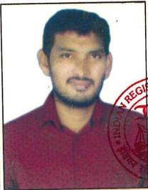
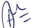
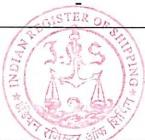
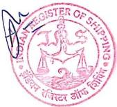

# WELDER'S QUALIFICATION CERTIFICATE

Port Visakhapatnam

Welder's Name: K.NARESH

Date of Birth: ___ 08 JULY 1988 Sex: Male

Identification No: W-196

Employer’s name and Patel Engineering Works, No.15, 1 $ ^{st} $  Floor, City Plaza, Dabagardens Visakhapatnam-20.

WPS/pWPS No: 76

Date 09 Jan 2025

Date of initial approval: 09 Jan 2025

Certificate No. VKM25X001/2

This is to certify that the welder has passed the qualification test /and re-validation record audit $ ^{*} $  according to IRS classification Notes on Qualification scheme for welders of Hull structural steels (hereinafter referred to IRS CN), and is qualified to undertake welding operation specified in range of qualification of this certificate.

<table border=1 style='margin: auto; width: max-content;'><tr><td style='text-align: center;'>Items</td><td style='text-align: center;'>Test Piece</td><td style='text-align: center;'>Range of qualification</td></tr><tr><td style='text-align: center;'>Welding process</td><td style='text-align: center;'>FCAW (S)</td><td style='text-align: center;'>FCAW (S)</td></tr><tr><td style='text-align: center;'>Base metal</td><td style='text-align: center;'>DMR 249A</td><td style='text-align: center;'>yield ≤460 N/mm² on tested material</td></tr><tr><td style='text-align: center;'>Filler metal type</td><td style='text-align: center;'>E 80T5-G (OK TUBROD 15.24IN)</td><td style='text-align: center;'>E 80T5-G</td></tr><tr><td style='text-align: center;'>Plate thickness</td><td style='text-align: center;'>12 mm</td><td style='text-align: center;'>3mm and above</td></tr><tr><td style='text-align: center;'>Type of welded joint</td><td style='text-align: center;'>SINGLE &#x27;V&#x27; BUTT, SINGLE SIDED WELD WITH BACKING (A)</td><td style='text-align: center;'>A, C &amp; F as per Table 2 of UR W32 (Rev.1 Sept 2020)</td></tr><tr><td style='text-align: center;'>Welding position</td><td style='text-align: center;'>PF (4G)</td><td style='text-align: center;'>PA(1G), PC(2G), PE (4G) - Butt PA, PB (1F), PC(2F), PD, PE(4F) - Fillet</td></tr><tr><td style='text-align: center;'>Revalidation method</td><td style='text-align: center;'>In accordance with IRS CN 6.2.1 a) ☑</td><td style='text-align: center;'>b) □ c) □</td></tr><tr><td style='text-align: center;'>Other details (specify............)</td><td style='text-align: center;'>-</td><td style='text-align: center;'>-</td></tr></table>

This certificate is issued at Visakhapatnam, and valid until 08 Jan 2028.

Signature/seal of examiner...A K Tyagi, issued on 09 Jan 2025

<table border=1 style='margin: auto; width: max-content;'><tr><td style='text-align: center;'></td><td style='text-align: center;'>Report no. to be reviewed</td><td style='text-align: center;'>Date of report</td><td style='text-align: center;'>Signature of Employee</td><td style='text-align: center;'>Date of signature</td></tr><tr><td style='text-align: center;'>1</td><td style='text-align: center;'></td><td style='text-align: center;'></td><td style='text-align: center;'></td><td style='text-align: center;'></td></tr><tr><td style='text-align: center;'>2</td><td style='text-align: center;'></td><td style='text-align: center;'></td><td style='text-align: center;'></td><td style='text-align: center;'></td></tr><tr><td style='text-align: center;'>3</td><td style='text-align: center;'></td><td style='text-align: center;'></td><td style='text-align: center;'></td><td style='text-align: center;'></td></tr><tr><td style='text-align: center;'>4</td><td style='text-align: center;'></td><td style='text-align: center;'></td><td style='text-align: center;'></td><td style='text-align: center;'></td></tr><tr><td style='text-align: center;'>5</td><td style='text-align: center;'></td><td style='text-align: center;'></td><td style='text-align: center;'></td><td style='text-align: center;'></td></tr></table>

## TEST RECORD

<table border=1 style='margin: auto; width: max-content;'><tr><td style='text-align: center;'>Type of test</td><td style='text-align: center;'>Performed and accepted</td><td style='text-align: center;'>Not required</td></tr><tr><td style='text-align: center;'>Visual examination</td><td style='text-align: center;'>Accepted</td><td style='text-align: center;'>-</td></tr><tr><td style='text-align: center;'>Radiographic examination</td><td style='text-align: center;'>Accepted (HSL R. No. 05/2025, 09/01/2025)</td><td style='text-align: center;'>-</td></tr><tr><td style='text-align: center;'>Surface examination</td><td style='text-align: center;'>-</td><td style='text-align: center;'>Not required</td></tr><tr><td style='text-align: center;'>Macro examination</td><td style='text-align: center;'>-</td><td style='text-align: center;'>Not required</td></tr><tr><td style='text-align: center;'>Fracture test</td><td style='text-align: center;'>-</td><td style='text-align: center;'>Not required</td></tr><tr><td style='text-align: center;'>Bend test</td><td style='text-align: center;'>-</td><td style='text-align: center;'>Not required</td></tr><tr><td style='text-align: center;'>Additional tests</td><td style='text-align: center;'>-</td><td style='text-align: center;'>Not required</td></tr></table>

This Certificate is issued upon the following terms and conditions as laid down in the Society's Regulations:-

Whilst Indian Register of Shipping, a Classification Society, along with its subsidiaries and associates (hereinafter referred to as the Society) and its Board/Committees use their best endeavors to ensure that the functions of the Society are properly carried out, in providing services, information or advice neither the Society nor any of its servants nor agents warrants the accuracy of any information or advice supplied. Except as set out herein neither the Society nor any of its servants nor agents (on behalf of each of whom the Society has agreed this clause) shall be liable for any loss damage or expense whatever sustained by any person due to any act or omission or error of whatsoever nature and however caused of the Society, its servants or agents or due to any inaccuracy of whatsoever nature and howsoever caused in any information or advice given in any way whatsoever by or on behalf of the Society, even if held to amount to a breach of warranty. Nevertheless, if any person uses services of the Society, or relies on any information or advice given by or on behalf of the Society and suffers loss damage or expenses thereby which is proved to have been due to any negligent act omission or error of the Society, its servants or agents or any negligent inaccuracy in information or advice given by or on behalf of the Society then the Society will pay compensation to such person for his proved loss up to but not exceeding the amount of the fee charged by the Society for that particular service, information or advice.

Any notice of claim for loss, damage or expense, as referred to above, shall be made in writing to the Society’s Head Office within six months of the date when the service, information or advice was first provided, failing which all the rights to any such claim shall be forfeited and the Society shall be relieved and discharged from all liabilities.